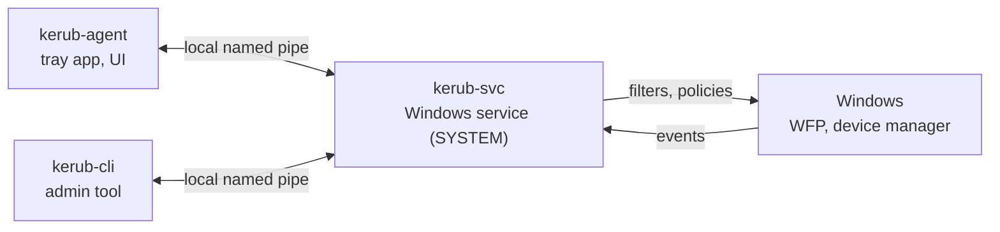

# Kerub

**An open-source guardian for Windows workstations.**
Kerub controls what gets plugged in, what the machine talks to, and watches
for signs of intrusion — and it explains every decision it makes.

> ⚠️ **Kerub is in its design phase.** There is no usable release yet.
> Do not install development builds on a machine you depend on.

---

## Why Kerub?

Windows Defender and the built-in firewall do a good job, but a personal PC
still has gaps: any USB device is trusted the moment it is plugged in,
public Wi-Fi exposes legacy protocols, VPNs leak when they drop, and the
traces of an attack sit unread in the event logs. Existing answers are
either fragmented tools for experts, or enterprise products built for
fleets managed by a security team.

Kerub brings these protections together in one lightweight, transparent
tool for an individual machine. [Read the full vision →](docs/vision.md)

## What it will do

| Module | Protection | Target |
|--------|------------|--------|
| **Network guard** | Per-network profiles, hardening on public networks, VPN kill switch with DNS and IPv6 leak protection | v0.2 |
| **Detection & response** | Detects intrusion attempts in Windows and Sysmon logs, maps them to MITRE ATT&CK, responds (for example by blocking an IP) | v0.3 |
| **Device control** | Unknown USB storage blocked until approved; new keyboards confirmed before they can type (BadUSB) | v0.4 |
| **Security posture** | Audits the machine's configuration and explains how to improve it | v0.5 |
| **File checks** | Inspects downloads before they run (signature, origin, reputation) | after v1.0 |

Every alert says what happened, why it matters and what you can do. Every
action Kerub takes can be undone.

## Principles

- **Never lock the user out** — every action is reversible, and a documented
  recovery procedure always exists.
- **Observe before enforcing** — every protection starts in audit mode.
- **Local and private** — no telemetry; nothing leaves the machine without
  explicit opt-in. [Privacy policy →](docs/privacy.md)
- **Defend itself** — the privileged part is minimal; Kerub must never
  become the weakest point of the machine.
- **Honest about its limits** — see below.

## How it works

- **`kerub-svc`** — the only privileged component: it observes, detects,
  decides and acts through documented Windows APIs.
- **`kerub-agent`** — shows status, alerts and prompts. It asks; it never
  decides.
- **`kerub-cli`** — administration and emergency recovery.

Kerub is written in **Rust**, with a **Tauri + React** interface, and uses
the **Windows Filtering Platform** for network enforcement. It contains no
kernel driver. [Architecture →](docs/architecture.md) ·
[Design decisions →](docs/adr/)

## Security model — and its limits

Kerub is designed against opportunistic physical attackers, hostile local
networks, remote attackers, and malware running with the user's
privileges. It does **not** protect against an attacker who already has
administrator rights: without a Microsoft-signed kernel component, no
user-mode tool can. [Threat model →](docs/threat-model.md)

Found a vulnerability? Please follow the [security policy](SECURITY.md).

## Project status

| Milestone | Content | Status |
|-----------|---------|--------|
| Design | Vision, threat model, requirements, architecture, ADRs | ✅ Done |
| v0.1 | Walking skeleton: service, secure IPC, agent | Planned |
| v0.2 | Network guard and VPN kill switch | Planned |
| v0.3 | Detection and response | Planned |
| v0.4 | Device control | Planned |
| v0.5 | Posture audit and onboarding | Planned |
| v1.0 | Hardening, installer, first release | Planned |

[Full roadmap →](docs/roadmap.md)

## Documentation

| Document | Content |
|----------|---------|
| [Vision](docs/vision.md) | Problem, users, principles, non-goals |
| [Threat model](docs/threat-model.md) | What Kerub defends against, and what it does not |
| [Requirements](docs/requirements.md) | Functional, non-functional and security requirements |
| [Architecture](docs/architecture.md) | Processes, components, flows, lifecycle |
| [ADRs](docs/adr/) | Why each major technical choice was made |
| [IPC protocol](docs/ipc-protocol.md) | How the agent and the service talk |
| [Event schema](docs/event-schema.md) | Format of events, alerts and actions (ECS) |
| [Privacy](docs/privacy.md) | What is collected, kept and sent |
| [Roadmap](docs/roadmap.md) | Milestones and tasks |
| [Lab setup](docs/dev/lab-setup.md) · [Recovery](docs/dev/recovery.md) | Test environment and emergency procedures |
| [Glossary](docs/glossary.md) | Project vocabulary |

## Building

Build instructions will be added with the first code milestone.

## How this project is built

Kerub is a personal project, developed with the help of an AI coding
assistant (Claude Code) under strict rules: one planned task at a time,
tests required, an independent security review of every change, and a
human review in which the author must understand every line before it is
merged. System-level behavior is tested only in an isolated lab. See the
[Definition of Done](docs/roadmap.md#12-definition-of-done-every-task).

## License

Licensed under the [Apache License 2.0](LICENSE).

---

Built by Quentin ([TouyA0](https://github.com/TouyA0)).