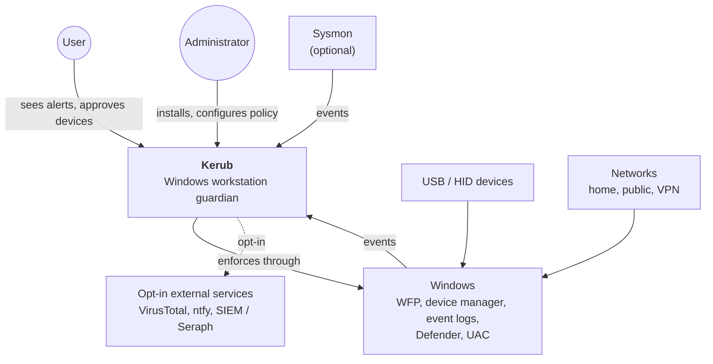
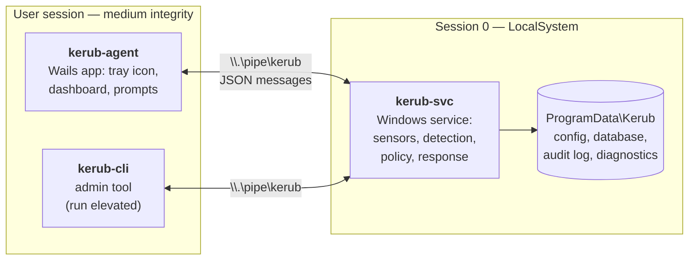
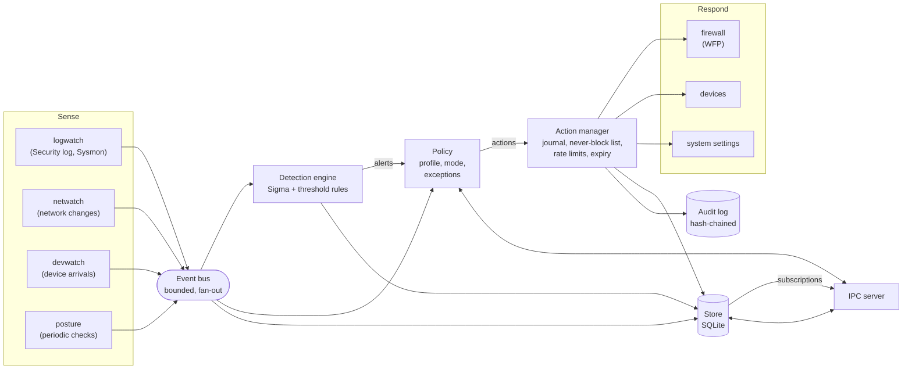
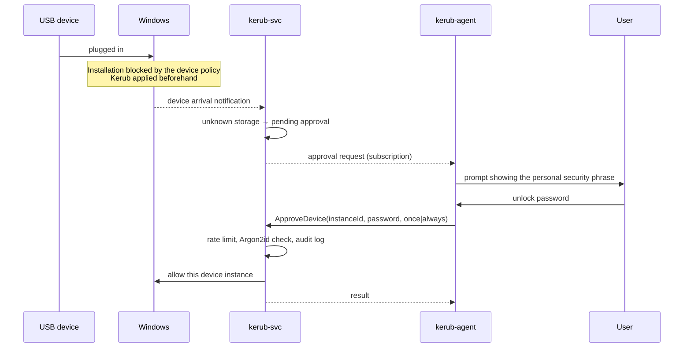
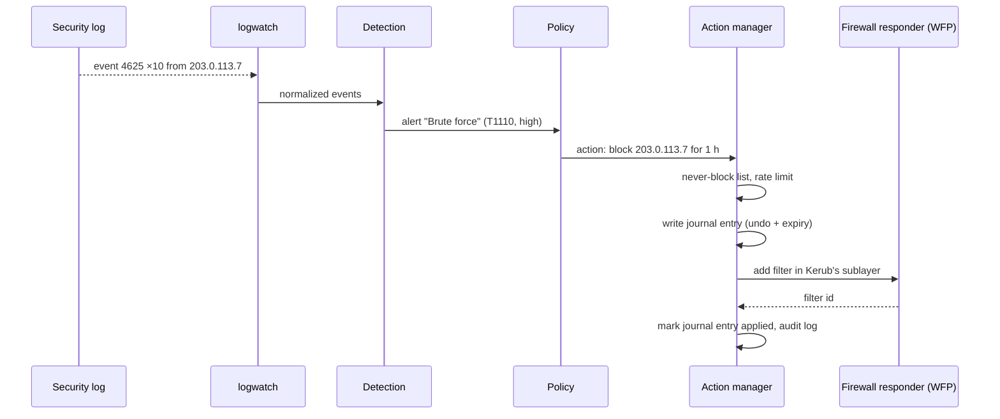

# Kerub — Architecture

| | |
|---|---|
| **Status** | Draft |
| **Related** | [vision.md](vision.md), [threat-model.md](threat-model.md), [requirements.md](requirements.md), [ipc-protocol.md](ipc-protocol.md), [event-schema.md](event-schema.md), [adr/](adr/) |

This document describes how Kerub is built. It goes from the widest view
(Kerub in its environment) to the narrowest (components inside the service),
then covers data flows, lifecycle, storage and the repository layout.

---

## 1. Key decisions

These decisions shape everything else. Each links to its ADR when one exists.

| # | Decision | Why | Record |
|---|----------|-----|--------|
| D1 | Go for all Kerub binaries | Memory safety for SYSTEM code, single static binary, good Windows support | [ADR-0001](adr/0001-use-go.md) |
| D2 | Wails (Go + web front-end) for the agent UI | Reuses web skills, native window through WebView2 | [ADR-0002](adr/0002-use-wails.md) |
| D3 | Windows Filtering Platform for all network enforcement | Persistent and boot-time filters, own sublayer, clean removal | [ADR-0003](adr/0003-use-wfp.md) |
| D4 | SQLite for local storage | Embedded, transactional, no server | [ADR-0004](adr/0004-use-sqlite.md) |
| D5 | Named pipe + JSON messages for agent ↔ service | Local-only, ACL-protected, easy to validate and fuzz | [ADR-0005](adr/0005-ipc-named-pipe-json.md) |
| D6 | No kernel driver | Signing requirements and risk are out of proportion for this project | [ADR-0006](adr/0006-no-kernel-driver.md) |
| D7 | Three processes with privilege separation | Only the service is privileged; the UI holds no authority | this document, §3 |
| D8 | Windows-specific code isolated in `internal/platform` | Testable logic, one place to audit dangerous calls | this document, §7 |
| D9 | Every action is journaled before execution, with undo and expiry | Reversibility, crash recovery, clean uninstall | this document, §5.3 |
| D10 | Two separate logs: diagnostic log and security audit log | Different audiences, different integrity guarantees | this document, §6 |

---

## 2. Context — Kerub in its environment



Kerub never talks to hardware or the network directly: it observes and acts
through documented Windows APIs.

---

## 3. Containers — the three processes



| Container | Runs as | Responsibilities | Must never |
|-----------|---------|------------------|------------|
| `kerub-svc` | `LocalSystem`, session 0, starts at boot | Collects events, detects, decides, acts, stores, serves the IPC | Show UI; trust the agent's decisions |
| `kerub-agent` | Interactive user, starts at logon | Displays status, timeline and alerts; asks the user for approvals; forwards requests | Make security decisions; verify passwords; write configuration |
| `kerub-cli` | Administrator, elevated on demand | Status, maintenance mode, diagnostics, emergency reset | Bypass the service for normal operations (emergency reset excepted) |

**Golden rule: the agent asks, the service decides.** Any request coming
through the pipe is treated as untrusted input, whoever sends it.

---

## 4. Components — inside `kerub-svc`

### 4.1 Overview



### 4.2 Two control styles

Kerub acts in two different ways, and both go through the action manager.

- **Reactive** — an event triggers a detection, the detection raises an
  alert, the policy turns the alert into actions.
  *Example: 10 failed logons from one IP → alert T1110 → block the IP for 1 h.*
- **Declarative** — the policy defines a *desired state*, and a controller
  continuously brings the system to that state (like a Kubernetes
  controller).
  *Example: current network is "public" → the public-profile filters must
  exist → create what is missing, remove what is extra.*

Network profiles, the VPN kill switch and device policies are declarative.
Detections are reactive.

### 4.3 Packages and responsibilities

| Package | Responsibility |
|---------|----------------|
| `internal/app` | Wires everything together; startup and shutdown sequences |
| `internal/event` | Event types (ECS subset, see [event-schema.md](event-schema.md)) |
| `internal/bus` | Bounded fan-out pipeline; counts and reports dropped events |
| `internal/module` | Module contract and supervisor (panic recovery, restart, health) |
| `internal/modules/*` | One package per module: `netguard`, `vpnguard`, `usbguard`, `logwatch`, `posture`, later `filewatch` |
| `internal/detect` | Rule loading, Sigma matching, threshold correlation, alert creation |
| `internal/policy` | Turns alerts and desired states into actions according to profile, mode and exceptions |
| `internal/respond` | Action manager and responders (firewall, devices, settings) |
| `internal/store` | SQLite access, migrations, retention |
| `internal/auditlog` | Append-only, hash-chained security log |
| `internal/config` | Embedded defaults, loading, validation, versioning, hot reload |
| `internal/ipc` | Pipe server and client, authentication, message types |
| `internal/secret` | Argon2id hashing, DPAPI wrappers |
| `internal/platform` | Interfaces to Windows (`windows/`) and their test doubles (`fake/`) |
| `internal/version` | Build version, injected at build time |

**Dependency rule:** packages depend inward. `modules` may use `detect`,
`policy`, `respond` and `platform` interfaces; nothing depends on
`modules`; nothing outside `platform/windows` imports
`golang.org/x/sys/windows`.

### 4.4 Main contracts (sketch)

```go
// A Module is one independently switchable feature.
type Module interface {
    Name() string
    Start(ctx context.Context, deps Deps) error // must return quickly; work runs in goroutines
    Stop(ctx context.Context) error
    Health() Health                              // Running, Degraded, Failed + reason
}

// A Sensor turns a Windows signal into normalized events.
type Sensor interface {
    Run(ctx context.Context, emit func(event.Event)) error
}

// A Responder applies one kind of action and knows how to undo it.
type Responder interface {
    Kind() action.Kind
    Apply(ctx context.Context, a action.Action) (action.Undo, error)
    Revert(ctx context.Context, u action.Undo) error
    // Observed returns what actually exists in the system, for reconciliation.
    Observed(ctx context.Context) ([]action.Observed, error)
}
```

These are sketches: exact signatures are decided when each package is
implemented.

---

## 5. Key flows

### 5.1 Unknown USB storage device



The device is blocked **before** Kerub even sees it: Windows enforces the
installation policy on its own, so a BadUSB device cannot win a race against
the service.

### 5.2 Brute-force attempt



In **audit mode**, the policy still produces the action, but the action
manager records it as *simulated* and stops there.

### 5.3 Action lifecycle

Every change Kerub makes to the system follows the same path:

1. **Plan** — the policy produces an action.
2. **Check** — never-block list, rate limits, module mode.
3. **Journal** — the action is written to the store *before* execution,
   with the information needed to undo it and its expiry.
4. **Apply** — the responder executes it.
5. **Confirm** — the journal entry is marked applied (or failed) and an
   audit-log entry is written.
6. **Expire or revert** — on expiry, user request or uninstall, the
   responder reverts it using the stored undo information.

When Kerub changes an existing system setting (for example disabling
LLMNR), the **previous value** is part of the undo information, so the
machine returns exactly to its prior state.

---

## 6. State, storage and logs

### 6.1 On-disk layout

| Path | Content | Access |
|------|---------|--------|
| `C:\Program Files\Kerub\` | Binaries | Admin write, everyone read |
| `C:\ProgramData\Kerub\config\` | `policy.yaml` (current configuration) | SYSTEM + Administrators |
| `C:\ProgramData\Kerub\data\kerub.db` | SQLite database | SYSTEM + Administrators |
| `C:\ProgramData\Kerub\audit\` | Hash-chained security audit log | SYSTEM + Administrators |
| `C:\ProgramData\Kerub\logs\` | Diagnostic logs (JSON, rotated) | SYSTEM + Administrators |
| `%LOCALAPPDATA%\Kerub\` | Agent UI preferences and agent logs (nothing sensitive) | Current user |

### 6.2 Database

Main tables: `events`, `alerts`, `actions` (journal), `exceptions`,
`devices` (allow-list), `config_versions`. Schema changes go through
numbered migrations in `internal/store/migrations`. Retention and size cap
follow NFR-PERF-005.

### 6.3 Configuration

Three layers, the last one wins:

1. **Defaults** embedded in the binary;
2. **Policy file** `policy.yaml`, written only by the service;
3. **Changes** requested through the agent or CLI, validated by the service,
   then written as a new policy version.

Writes are atomic (write to a temporary file, then rename). Every version is
kept in `config_versions`. If the current file is invalid at startup, the
service falls back to the last known good version and raises an alert.

### 6.4 Two logs, two purposes

| | Diagnostic log | Security audit log |
|---|---|---|
| **Audience** | Developer, troubleshooting | User, investigator, SIEM |
| **Content** | Errors, timings, internal state | Alerts, actions, approvals, config changes, IPC requests |
| **Integrity** | Plain rotated JSON | Hash-chained, verified at startup |
| **Retention** | Short (size-based rotation) | Long (retention policy) |

Important security events are also written to the Windows Event Log
(Application, source `Kerub`) so that any existing log collector can pick
them up.

---

## 7. Platform layer

All Windows-specific code lives in `internal/platform`, behind interfaces:

| Interface | Wraps |
|-----------|-------|
| `Firewall` | WFP: provider, sublayer, filters |
| `Devices` | Device notifications, installation restrictions, enable/disable |
| `EventLogs` | Subscriptions to event channels |
| `Network` | Interfaces, profiles, network change notifications |
| `Security` | ACLs, tokens, process identity, Authenticode verification |
| `Secrets` | DPAPI |
| `Settings` | Registry and system settings, with read-before-write |

`platform/windows` holds the real implementations (`//go:build windows`);
`platform/fake` holds in-memory doubles used by unit tests. Rules for this
layer: DLLs loaded through `NewLazySystemDLL` only, every return code
checked, no business logic.

---

## 8. Lifecycle

### 8.1 Service startup

1. Load and validate configuration (fallback to last known good).
2. Open the store and run migrations.
3. Verify the audit-log hash chain; alert if broken.
4. **Reconcile**: compare the action journal with what actually exists in
   the system; revert expired actions, re-apply missing ones, remove
   unknown Kerub-owned artifacts.
5. Start modules under the supervisor.
6. Start the IPC server.
7. Report *ready*.

### 8.2 Service shutdown

Stop the IPC server, stop modules with a timeout, flush the store.
**Persistent protections stay in place** (kill switch, device policies):
stopping the service does not open the gates.

### 8.3 Uninstall

Stop the service, revert every journaled action, delete Kerub's WFP
provider and sublayer, restore previous system settings, remove the service
and binaries. Logs are kept only if the user asks for it.

### 8.4 Emergency reset

`kerub-cli emergency-reset` works **without the service**: it removes every
Kerub-owned filter and policy directly. A PowerShell fallback exists in
`scripts/emergency-reset.ps1`. Procedure: [dev/recovery.md](dev/recovery.md).

---

## 9. Identifiers

Fixed once, never changed:

| Item | Value |
|------|-------|
| Service name | `KerubSvc` |
| Pipe | `\\.\pipe\kerub` |
| Event Log source | `Kerub` |
| WFP provider GUID | generated in task T0.1, recorded in ADR-0003 |
| WFP sublayer GUID | generated in task T0.1, recorded in ADR-0003 |

---

## 10. Repository layout

```
kerub/
├── cmd/
│   ├── kerub-svc/           service entry point
│   ├── kerub-agent/         Wails app (Go + frontend/)
│   └── kerub-cli/           admin tool
├── internal/                see §4.3
├── rules/
│   ├── sigma/               Sigma detection rules
│   └── threshold/           threshold rules
├── configs/
│   ├── default-policy.yaml
│   └── sysmon/              recommended Sysmon configuration
├── scripts/                 dev install, emergency reset
├── installer/               MSI definition
├── test/
│   ├── e2e/                 end-to-end tests, run in the lab VM
│   └── fixtures/evtx/       recorded attack logs
└── docs/
```

---

## 11. Testing strategy

| Level | Where | What |
|-------|-------|------|
| Unit | CI and dev machine | All logic, with `platform/fake` |
| Fuzz | CI | IPC parser, rule parser, config parser |
| Detection | CI | Rules replayed against recorded EVTX attack samples |
| Integration | Lab VM only (`-tags integration`) | Real WFP, devices, event logs |
| End-to-end | Lab VM only | Installed service + agent + simulated attacks (Atomic Red Team) |

Integration and end-to-end tests **never** run on the development machine.

---

## 12. Build and release

- `Taskfile.yml` drives build, test, lint and packaging.
- The version is injected at build time into `internal/version`.
- CI (GitHub Actions, Windows runner) runs build, tests, linters, gosec
  and govulncheck on every pull request.
- Releases publish binaries, the installer and SHA-256 checksums; signing is
  added before v1.0 (SEC-SC-004).