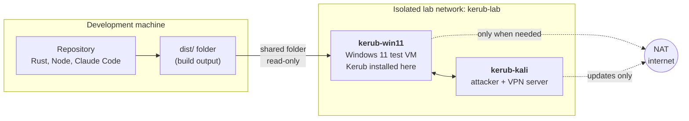
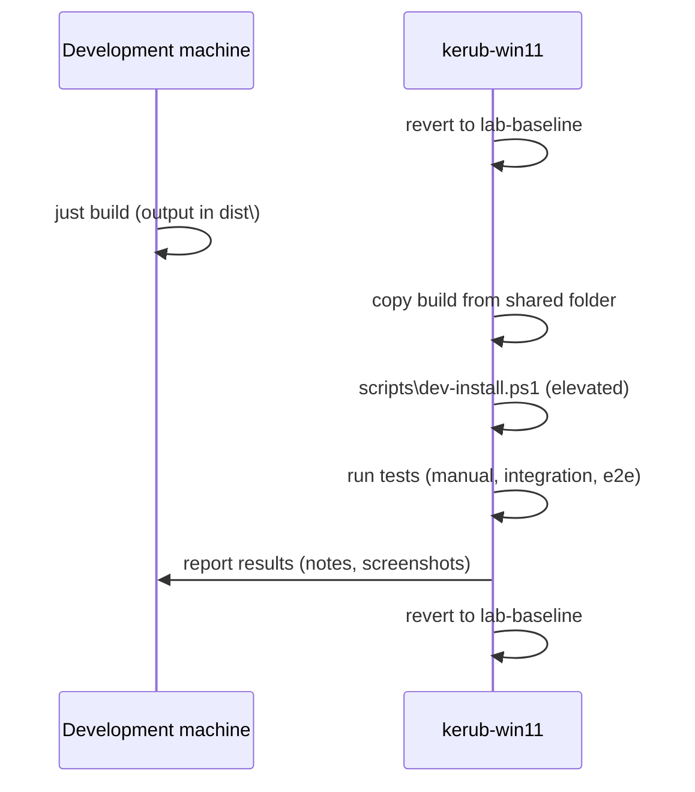

# Kerub — Lab Setup

| | |
|---|---|
| **Status** | Draft |
| **Related** | [recovery.md](recovery.md), [architecture.md](../architecture.md) §11, [ADR-0003](../adr/0003-use-wfp.md) |

Kerub changes firewall filters, device policies and system settings. A
mistake can cut network access or block devices **even after a reboot**.
This document describes the lab where everything that touches the system is
tested, and the rules that keep the development machine safe.

---

## 1. Golden rules

1. **Kerub never runs on the development machine.** Code is written,
   compiled and unit-tested there; it is installed and run only in the lab
   VM.
2. **Every test session starts from a snapshot** and ends by reverting to
   it.
3. **The lab network is isolated.** Attack tools never run on a network
   shared with real devices (home LAN, school, public Wi-Fi). Running
   Responder or a brute-force tool against devices you do not own is
   illegal.
4. **Claude Code runs on the development machine in a non-administrator
   terminal**, restricted to the repository (see `CLAUDE.md`).

---

## 2. Overview



---

## 3. Development machine

| Tool | Purpose |
|------|---------|
| **rustup** + stable toolchain, target `x86_64-pc-windows-msvc` | Build Kerub; the exact version comes from `rust-toolchain.toml` |
| **Visual Studio Build Tools**, workload *Desktop development with C++* | MSVC linker and Windows SDK required by Rust on Windows |
| **Node.js LTS** | Agent front-end |
| **Tauri prerequisites** | See the official Tauri guide for Windows (WebView2 is already present on Windows 11) |
| **just** | Task runner (`justfile`) |
| **cargo-audit**, **cargo-deny** | Dependency checks, same as CI |
| **Git**, commits signed with SSH | Version control |
| **Claude Code** | Development assistant, non-admin terminal |
| **WSL2** *(optional)* | Run fuzz targets locally (CI runs them on Linux) |

---

## 4. Hypervisor

The USB module needs **USB passthrough** (a physical device connected
directly to the VM), and Windows 11 needs a **virtual TPM**.

| Hypervisor | USB passthrough | vTPM | Verdict |
|------------|-----------------|------|---------|
| **VMware Workstation Pro** | Yes | Yes | **Recommended.** Free; download from the Broadcom support portal (account required) |
| **VirtualBox 7** | Yes (USB 2/3 with the Extension Pack) | Yes | Good alternative |
| **Hyper-V** | No generic USB passthrough | Yes | Not suitable for device tests |

If Hyper-V or WSL2 is enabled on the host, VMware and VirtualBox still work
on top of it, sometimes more slowly.

---

## 5. Windows test VM (`kerub-win11`)

### 5.1 Image

- **Windows 11 Enterprise, evaluation edition** (90 days), downloaded as an
  ISO from the Microsoft Evaluation Center.
- When the evaluation expires, rebuild the VM from the ISO following this
  document; the steps are designed to take under an hour.
- A Windows 10 22H2 VM will be added later for compatibility tests
  (NFR-COMP-001).

### 5.2 Virtual hardware

| Setting | Value |
|---------|-------|
| Firmware | UEFI, Secure Boot on |
| TPM | Virtual TPM 2.0 |
| CPU / RAM | 4 vCPU / 8 GB |
| Disk | 80 GB |
| Network adapter 1 | Isolated network `kerub-lab` (host-only / internal) |
| Network adapter 2 | NAT — **disconnected by default**, connected only for updates |
| USB | USB 3 controller enabled |

### 5.3 Accounts

| Account | Type | Use |
|---------|------|-----|
| `labadmin` | Administrator | Install Kerub, run the CLI elevated |
| `tester` | Standard user | Everyday tests — matches assumption A4 of the threat model |

### 5.4 Baseline configuration

1. Install all Windows updates (adapter 2 connected), then pause updates
   and disconnect adapter 2.
2. Keep **Microsoft Defender enabled** (assumption A3).
3. Install the **Microsoft Visual C++ Redistributable (x64)**, unless task
   T0.1 decides to link the C runtime statically.
4. Install **Sysmon** from Sysinternals with a community configuration
   (sysmon-modular) until Kerub's own configuration exists in
   `configs/sysmon/`.
5. Install the **Sysinternals Suite** (Process Explorer, Process Monitor)
   and the **WireGuard** client.
6. Enable the audit policies Kerub relies on (elevated prompt):

   ```
   auditpol /set /subcategory:"Logon" /success:enable /failure:enable
   auditpol /set /subcategory:"User Account Management" /success:enable /failure:enable
   auditpol /set /subcategory:"Security Group Management" /success:enable /failure:enable
   ```

7. Enable **Remote Desktop**, reachable only from `kerub-lab`, to test
   brute-force detection.
8. Create the working folder `C:\KerubDev\`.

### 5.5 Shared folder

- The host's `dist\` folder is shared with the VM **read-only**: the VM can
  take new builds, but a compromised or broken VM cannot write back to the
  host.
- Clipboard sharing and drag-and-drop are disabled in the `defender-off`
  snapshot (§7).

---

## 6. Attacker VM (`kerub-kali`)

- **Kali Linux**, connected to `kerub-lab` only; the NAT adapter is
  connected only to update packages.
- Used for:
  - LLMNR / NBT-NS poisoning with **Responder** (FR-NET-003);
  - RDP brute force with **Hydra** (FR-DET-004);
  - port scans with **Nmap**;
  - a **WireGuard** server, so the Windows VM has a VPN to test the kill
    switch against (FR-NET-004 to FR-NET-007).
- Killing the WireGuard server simulates "the VPN dropped".

---

## 7. Snapshots

| Snapshot | Based on | Content | Used for |
|----------|----------|---------|----------|
| `clean-os` | — | Windows installed and updated, accounts created | Starting point if the baseline must be rebuilt |
| `lab-baseline` | `clean-os` | Everything in §5.4 and §5.5 | **Every normal test session** |
| `defender-off` | `lab-baseline` | Tamper Protection and real-time protection disabled, Invoke-AtomicRedTeam installed, shared folder and clipboard disabled | Detection tests with Atomic Red Team, which Defender would otherwise block |

Rules:

- Revert to the snapshot at the end of every session.
- Never keep working in a VM state that has not been reverted since Kerub
  was installed on it.
- Update `lab-baseline` deliberately (new tools, Windows updates), and note
  the date in the snapshot description.

---

## 8. Test loop



The `dev-install.ps1` script and the integration test commands are created
by the roadmap tasks that need them.

---

## 9. Detection test data

- **Recorded attack logs** (EVTX samples, for example the
  EVTX-ATTACK-SAMPLES project) are used by detection tests in CI. Check each
  source's license before committing samples to the repository; otherwise
  download them during the CI job.
- **Live attacks** come from Atomic Red Team in the `defender-off` snapshot
  and from `kerub-kali`.

---

## 10. Readiness checklist

Before the first task that installs anything in the lab:

- [ ] Hypervisor installed, `kerub-lab` isolated network created
- [ ] `kerub-win11` built with UEFI, Secure Boot, vTPM, two adapters
- [ ] `labadmin` and `tester` accounts created
- [ ] Baseline configuration (§5.4) done
- [ ] Read-only shared folder working
- [ ] Snapshots `clean-os` and `lab-baseline` taken
- [ ] `kerub-kali` built on `kerub-lab`, WireGuard server reachable from `kerub-win11`
- [ ] [recovery.md](recovery.md) read and understood