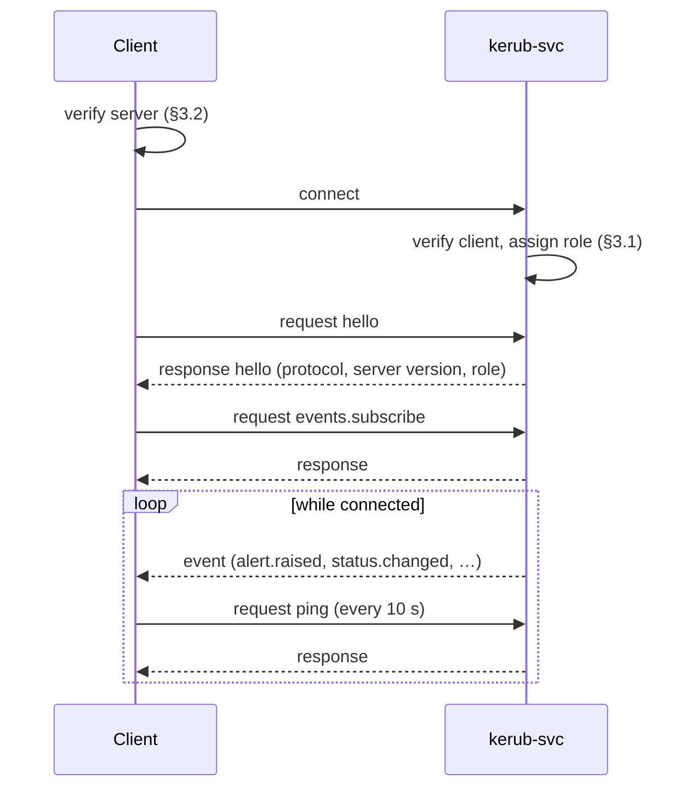

# Kerub — IPC Protocol

| | |
|---|---|
| **Protocol version** | 1 |
| **Status** | Draft |
| **Related** | [ADR-0005](adr/0005-ipc-named-pipe-json.md), [threat-model.md](threat-model.md) §5.1, [requirements.md](requirements.md) (`SEC-IPC-*`), [architecture.md](architecture.md) §3 |

This document specifies how `kerub-agent` and `kerub-cli` (the **clients**)
talk to `kerub-svc` (the **server**).

**Source of truth.** The Rust types in the `kerub-ipc` crate define the
protocol; this document describes them. A change to one must update the
other in the same pull request.

---

## 1. Principles

1. **The server trusts nothing it receives.** Every message is validated as
   if it came from an attacker, whoever the client is.
2. **Strict server, tolerant clients.** The server rejects unknown fields;
   clients ignore unknown fields in responses and events. The server can
   therefore add fields without breaking older clients.
3. **No generic operations.** There is no "run command", "write file" or
   "set arbitrary key" message. Every capability is a named, typed request.
4. **Authority lives in the server.** Roles, passwords, rate limits and
   validation are all checked server-side.

---

## 2. Transport

| Property | Value |
|----------|-------|
| Name | `\\.\pipe\kerub` |
| Created by | `kerub-svc`, at startup |
| Mode | Byte mode; framing is done by Kerub (§4) |
| First instance | Required: creation fails if the name already exists (TM-IPC-2) |
| Remote clients | Rejected (TM-IPC-7) |
| Maximum simultaneous clients | 8 |
| Frame read timeout | 5 s from the first byte of a frame |
| Idle timeout | 5 min without any message, unless the connection has an active subscription |

### 2.1 Security descriptor

| Principal | Access |
|-----------|--------|
| `SYSTEM` | Full control (owner) |
| `Administrators` | Read / write |
| `INTERACTIVE` (users logged on locally) | Read / write |
| `NETWORK` | **Explicit deny** |
| Everyone else | No access (no entry) |
| Mandatory integrity label | **Medium, no-write-up** — low-integrity processes cannot connect (TM-IPC-8) |

The descriptor is built in `kerub-platform`, the only crate allowed to use
`unsafe`.

---

## 3. Peer verification

### 3.1 Server verifies the client (TM-IPC-1)

On every new connection, before reading the first message:

1. **Client token.** Impersonate the client just long enough to read its
   token, then revert. Record the user SID, session ID, group membership and
   elevation. The token is read directly from the connection, which avoids
   relying on a process ID that could be reused.
2. **Client process.** Get the client process ID from the pipe, open the
   process, and read its full image path. It must be
   `C:\Program Files\Kerub\kerub-agent.exe` or
   `C:\Program Files\Kerub\kerub-cli.exe`.
3. **Signature.** Verify the image's Authenticode signature and that the
   signer is Kerub's certificate. Before release signing exists, debug
   builds only may skip this step, and log that they did.
4. **Role.** Assign the connection a role:

| Role | Condition |
|------|-----------|
| `user` | Verified client, standard token |
| `admin` | Verified `kerub-cli`, elevated token, member of `Administrators` |

Any failure closes the connection without a response and writes an audit
entry.

### 3.2 Client verifies the server (TM-IPC-2)

Before sending anything, the client checks:

1. **Pipe owner.** The owner of the pipe object must be `SYSTEM`
   (`S-1-5-18`). A squatting process running as a user cannot create a pipe
   owned by `SYSTEM`.
2. **Server process.** The server process image must be
   `C:\Program Files\Kerub\kerub-svc.exe`. The service's process DACL grants
   interactive users the limited query right needed for this check.

If either check fails, the client closes the connection, sends nothing, and
shows a "service unreachable or impersonated" alert.

---

## 4. Framing

Each message is one frame:

```
┌──────────────────────┬─────────────────────────────┐
│ length: u32, little- │ payload: UTF-8 JSON object, │
│ endian, in bytes     │ exactly `length` bytes      │
└──────────────────────┴─────────────────────────────┘
```

- `length` excludes the 4-byte header, must be ≥ 2 and ≤ **65 536**.
- A frame with an invalid length or invalid UTF-8/JSON causes an error
  response when possible, then the connection is closed.
- One frame contains exactly one JSON object.

---

## 5. Envelope

Every message has the same envelope:

```json
{
  "v": 1,
  "id": "2f9c0a6e-5b0e-4d6f-9a37-1c1b8f2e7d40",
  "kind": "request",
  "type": "status.get",
  "payload": {}
}
```

| Field | Type | Rules |
|-------|------|-------|
| `v` | integer | Protocol version; must be `1` |
| `id` | string | UUID v4, generated by the sender |
| `kind` | string | `request`, `response` or `event` |
| `type` | string | Message type (§8); `[a-z_]+(\.[a-z_]+)*`, ≤ 64 characters |
| `re` | string | **Responses only**: `id` of the request being answered |
| `payload` | object | Type-specific content; `{}` when empty |
| `error` | object | **Responses only**, instead of a successful payload (§6) |

A response carries either `payload` or `error`, never both.

---

## 6. Errors

```json
{
  "v": 1,
  "id": "9b1f…",
  "kind": "response",
  "type": "device.approve",
  "re": "2f9c…",
  "error": { "code": "auth_failed", "message": "Invalid password.", "retry_after_ms": 30000 }
}
```

| Code | Meaning |
|------|---------|
| `unsupported_version` | `v` not supported |
| `malformed` | Invalid frame, JSON or envelope |
| `too_large` | Frame over 64 KiB |
| `unknown_type` | No such message type |
| `validation_failed` | Payload does not match the schema or its limits |
| `unauthorized` | The connection's role cannot use this message |
| `auth_failed` | Wrong password |
| `rate_limited` | Too many requests; see `retry_after_ms` |
| `not_found` | Referenced object does not exist |
| `conflict` | State changed since the client read it (for example a configuration version) |
| `unavailable` | Module disabled or not ready |
| `internal` | Unexpected server error |

Error messages are short and generic: they never contain stack traces,
file paths or internal state. Details go to the diagnostic log only.

---

## 7. Session lifecycle



- The **first** message must be `hello`; anything else gets `malformed` and
  the connection is closed.
- The agent sends `ping` every 10 seconds. Three missed responses trigger
  the "service unreachable" alert (SEC-SVC-005).

---

## 8. Message catalog (version 1)

**Access** column: `U` = `user` role; `U+P` = `user` role plus the unlock
password in the payload; `A` = `admin` role. The catalog grows with the
roadmap; every addition updates this table.

### 8.1 Session

| Type | Access | Purpose |
|------|--------|---------|
| `hello` | U | Negotiate the protocol version and get the connection's role |
| `ping` | U | Heartbeat |

### 8.2 Status and timeline

| Type | Access | Purpose |
|------|--------|---------|
| `status.get` | U | Global status and health of every module |
| `timeline.query` | U | Page through events, alerts and actions (filters: time range, kinds, minimum severity, text; ≤ 500 items per page, cursor-based) |
| `alert.get` | U | Full detail of one alert |

### 8.3 Subscriptions

| Type | Access | Purpose |
|------|--------|---------|
| `events.subscribe` | U | Start receiving events for the given topics |
| `events.unsubscribe` | U | Stop receiving events |

Topics: `status`, `alerts`, `approvals`, `actions`.

### 8.4 User decisions

| Type | Access | Purpose |
|------|--------|---------|
| `device.approve` | U+P | Approve a pending device, `once` or `always` |
| `device.deny` | U | Refuse a pending device |
| `action.revert` | U+P | Undo an action Kerub applied |
| `alert.mark_false_positive` | U+P | Create a narrowly scoped exception (one rule, one entity) |
| `network.set_profile` | U+P | Assign a profile to the current network |
| `captive_portal.allow` | U+P | Open a time-limited exception (≤ 10 min) to reach a captive portal |

Every request that weakens protection requires the password, because
malware running as the user could otherwise send it (TM-IPC-1).

### 8.5 Administration

| Type | Access | Purpose |
|------|--------|---------|
| `config.get` | A | Current configuration and its version |
| `config.set` | A | Apply changes on top of a given base version (`conflict` if outdated) |
| `module.set_mode` | A | Set a module to `off`, `audit` or `enforce` |
| `maintenance.enter` | A | Suspend enforcement for ≤ 60 min, with a reason |
| `maintenance.exit` | A | End maintenance mode |
| `diagnostics.export` | A | Write a diagnostic bundle and return its path |

### 8.6 Events (server → client)

| Type | Topic | Content |
|------|-------|---------|
| `status.changed` | `status` | New global status and module health |
| `alert.raised` | `alerts` | Alert summary (ID, severity, title, MITRE technique) |
| `approval.requested` | `approvals` | Pending device or decision awaiting the user |
| `approval.resolved` | `approvals` | Outcome of a pending approval |
| `action.applied` | `actions` | An action was applied (or simulated in audit mode) |
| `action.reverted` | `actions` | An action was reverted or expired |

### 8.7 Examples

`hello` request and response:

```json
{ "v": 1, "id": "a1…", "kind": "request", "type": "hello",
  "payload": { "client": "kerub-agent", "client_version": "0.1.0", "protocols": [1] } }

{ "v": 1, "id": "b2…", "kind": "response", "type": "hello", "re": "a1…",
  "payload": { "protocol": 1, "server_version": "0.1.0", "role": "user" } }
```

`device.approve` request:

```json
{ "v": 1, "id": "c3…", "kind": "request", "type": "device.approve",
  "payload": { "request_id": "d4…", "scope": "once", "password": "••••••••" } }
```

`alert.raised` event:

```json
{ "v": 1, "id": "e5…", "kind": "event", "type": "alert.raised",
  "payload": { "alert_id": "f6…", "severity": "high",
               "title": "Repeated failed logons from 203.0.113.7",
               "mitre": "T1110", "timestamp": "2026-09-26T08:15:02Z" } }
```

---

## 9. Validation rules

- Unknown fields and duplicate keys are rejected (`validation_failed`).
- Enumerations accept only their documented values.
- Identifiers are UUID v4 strings.
- Timestamps are RFC 3339 strings in UTC (`Z` suffix).
- Every string field has a maximum length (default 1 024 characters; free
  text such as a search query ≤ 256; passwords ≤ 256).
- Every integer field has a documented range (for example maintenance
  duration 1–60, captive portal 1–10, page size 1–500).
- Validation happens **before** any side effect.

---

## 10. Rate limiting (TM-IPC-4, TM-IPC-6)

| Limit | Value |
|-------|-------|
| Requests per connection | 20 per second, bursts up to 50 |
| Failed password attempts | After 5 failures, back-off starting at 30 s and doubling up to 15 min |
| Back-off scope | Per user SID, across all connections — reconnecting does not reset it |

A lockout raises an alert and writes an audit entry.

---

## 11. Audit and secrets

- **Every request** is written to the security audit log: type, request ID,
  client PID, image path, user SID, role, outcome (SEC-IPC-005).
- **Passwords are never logged**: password fields are redacted before any
  logging, including in diagnostic logs.
- Password buffers are wiped from memory after verification.
- Passwords only ever travel over the local pipe, never over a network.

---

## 12. Versioning

- `v` changes only for **breaking** changes: removed or renamed fields or
  types, changed meaning.
- Adding a field to a **response or event** is not breaking (clients are
  tolerant).
- Adding a field to a **request** is breaking for older servers, so the
  agent, CLI and service are always released together with the same version.
- The server answers `unsupported_version` for any version it does not
  implement; `hello` lets the client know which one to use.

---

## 13. Testing requirements

- A fuzz target feeds random bytes to the frame decoder and the message
  decoder (SEC-IPC-003).
- Every message type has JSON fixtures (valid and invalid) under
  `crates/kerub-ipc/tests/fixtures/`.
- Round-trip tests: every Rust type serializes and deserializes to the same
  value.
- TypeScript types for the agent front-end are generated from the Rust
  types, and CI fails if the generated files are out of date.