# Kerub — Roadmap

| | |
|---|---|
| **Status** | Living document — updated at the end of every task |
| **Related** | [vision.md](vision.md), [requirements.md](requirements.md), [architecture.md](architecture.md), [dev/lab-setup.md](dev/lab-setup.md), [dev/recovery.md](dev/recovery.md) |

This document turns the requirements into an ordered plan. Milestones are
released versions; tasks are units of work small enough for one working
session and one pull request.

**Planning style.** The first milestones are detailed task by task. Later
milestones are outlined, and refined when they start: what we learn along
the way will change them.

---

## 1. How to use this roadmap

### 1.1 Task lifecycle

1. **Pick** the first unchecked task whose dependencies are done.
2. **Branch** from `main`: `t<milestone>-<n>-<short-name>` (for example
   `t1-4-store`).
3. **Plan** before coding: read the task, the requirements it references and
   the relevant documents; write the plan; validate it.
4. **Implement** with tests first where possible.
5. **Verify** against the task's acceptance criteria and the Definition of
   Done (§1.2).
6. **Open a pull request** titled like a commit, with the task ID:
   `feat(store): add SQLite store with migrations [T1.4]`.
7. **Merge**, then check the task box below and add a CHANGELOG entry.

### 1.2 Definition of Done (every task)

- [ ] Builds on Windows; `cargo fmt`, `cargo clippy` (warnings as errors)
      and all tests pass locally and in CI.
- [ ] Every acceptance criterion of the task is met.
- [ ] Commits and PR reference the task ID and the requirement IDs.
- [ ] New or changed behavior is covered by tests.
- [ ] Documents affected by the change are updated in the same PR
      (architecture, protocol, schema, privacy, threat model…).
- [ ] `CHANGELOG.md` has an entry under *Unreleased*.
- [ ] Human review done: the author understands every line.
- [ ] Security review done against the threat model.
- [ ] **Extra for `kerub-platform` / `unsafe` code:** every `unsafe` block
      has a `// SAFETY:` comment and was reviewed line by line.
- [ ] **Extra for anything that changes the system:** tested in the lab VM,
      with test notes in the PR.

### 1.3 Task format

Each task lists: **Requirements** it implements, **Depends on**, main
**Scope** (crates or files), and **Acceptance criteria**. A task whose diff
grows beyond roughly 400 lines should be split.

---

## 2. Overview

```mermaid
flowchart LR
    P["P — Preparation<br/>Rust, lab, workspace"]
    M0["M0 — Foundations<br/>repo, CI, crates"]
    M1["v0.1 — Walking skeleton<br/>service, IPC, agent"]
    M2["v0.2 — Network guard<br/>WFP, kill switch"]
    M3["v0.3 — Detection<br/>rules, alerts, UI"]
    M4["v0.4 — Device control<br/>USB, HID"]
    M5["v0.5 — Posture & onboarding"]
    M6["v1.0 — Hardening & release"]
    P --> M0 --> M1 --> M2 --> M3 --> M4 --> M5 --> M6
```

| Milestone | Goal | Detail level |
|-----------|------|--------------|
| P | The author, the environment and the first design are ready | Detailed |
| M0 | A clean, checked, empty workspace | Detailed |
| v0.1 | Kerub installs, runs, talks, and uninstalls cleanly — with no protection yet | Detailed |
| v0.2 | First real protection: network profiles and VPN kill switch | Detailed |
| v0.3 | Detection and response from Windows logs, with the real UI | Outline |
| v0.4 | USB and HID device control | Outline |
| v0.5 | Posture audit, onboarding, exceptions, export | Outline |
| v1.0 | Self-protection review, installer, release, dogfooding | Outline |

---

## 3. P — Preparation *(human tasks)*

- [ ] **P.1 — Learn Rust.** *The Rust Programming Language* (chapters 1–16,
  then the async basics) and all *Rustlings* exercises.
  *Done when:* you can explain ownership, borrowing, lifetimes, `Result` and
  `?`, traits, and what `Send` and `Sync` mean.
- [ ] **P.2 — Build the lab.** Everything in the checklist of
  [lab-setup.md](dev/lab-setup.md) §10.
- [ ] **P.3 — Prepare the Claude Code workspace.** `CLAUDE.md` and
  `.claude/` in `projet-kerub/`, as designed in the planning phase.
- [ ] **P.4 — Re-read** the vision, threat model and architecture after
  learning Rust, and note anything that no longer makes sense.
- [x] **P.5 — First agent design** *(with Claude Design, in parallel with
  P.1)*. Colors (global states, severity levels, light and dark themes),
  typography, and the priority screens: tray menu, USB approval prompt, HID
  confirmation, first-run wizard, "service unreachable" state, dashboard,
  alert detail, network card → `docs/design/`.
  *Done when:* the security-sensitive screens are designed, and any gap they
  revealed in the requirements or the IPC protocol has been fixed in the
  documents.

---

## 4. M0 — Foundations

- [ ] **T0.1 — Workspace and tooling**
  - **Requirements:** NFR-MAINT-004, SEC-SC-001, ADR-0001
  - **Depends on:** P.1, P.3
  - **Scope:** root `Cargo.toml` (workspace, shared lints), `rust-toolchain.toml`,
    `rustfmt.toml`, `.cargo/config.toml`, `.gitignore`, `.editorconfig`,
    `justfile`, `deny.toml`, `CHANGELOG.md`
  - **Acceptance criteria:**
    - Workspace lints: `unsafe_code = "forbid"` by default, Clippy
      `undocumented_unsafe_blocks` enabled.
    - `just fmt`, `just lint`, `just test`, `just audit` work.
    - `deny.toml` allows only licenses compatible with Apache-2.0.
    - Decision on static linking of the C runtime taken and, if static,
      recorded in ADR-0008.
    - `CHANGELOG.md` follows *Keep a Changelog*.

- [ ] **T0.2 — Continuous integration**
  - **Requirements:** NFR-MAINT-004, SEC-SC-001, SEC-SC-003
  - **Depends on:** T0.1
  - **Scope:** `.github/workflows/ci.yml`, `.github/dependabot.yml`,
    `.github/pull_request_template.md`
  - **Acceptance criteria:**
    - Windows job: fmt check, Clippy, tests, `cargo audit`, `cargo deny`.
    - Linux job reserved for fuzz targets (empty for now).
    - Every third-party action pinned by commit SHA; workflow permissions
      set to read-only by default.
    - Dependabot configured for Cargo and GitHub Actions (npm added in T1.12).
    - PR template contains the Definition of Done checklist.
    - *Human step:* branch ruleset on `main` requiring CI and a PR; CodeQL
      enabled if Rust is supported by default setup.

- [ ] **T0.3 — Crate skeletons and dependency rules**
  - **Requirements:** NFR-MAINT-001, D8
  - **Depends on:** T0.1
  - **Scope:** `crates/*` and `apps/*` as listed in architecture §4.3 and §10
  - **Acceptance criteria:**
    - Every crate exists with a `lib.rs` (or `main.rs`) and a doc comment
      stating its responsibility.
    - Every crate except `kerub-platform` has `#![forbid(unsafe_code)]`.
    - `cargo deny` forbids the `windows` crate everywhere except as a
      dependency of `kerub-platform`.
    - `kerub-svc` and `kerub-cli` print their version.

- [ ] **T0.4 — Fixed identifiers**
  - **Requirements:** architecture §9, ADR-0003
  - **Depends on:** T0.3
  - **Scope:** `kerub-core` (identifiers module), ADR-0003, architecture §9
  - **Acceptance criteria:**
    - WFP provider and sublayer GUIDs generated once and defined as
      constants, with the service name, pipe name and Event Log source.
    - GUIDs written into the ADR-0003 table and architecture §9.

---

## 5. v0.1 — Walking skeleton

**Goal:** the three processes exist, the service installs and uninstalls
cleanly, the agent shows the service status. No protection yet — but every
security foundation (IPC, service hardening, logs) is real.

- [ ] **T1.1 — Core types**
  - **Requirements:** FR-DET-003, FR-VIS-002, [event-schema.md](event-schema.md)
  - **Depends on:** T0.3
  - **Scope:** `kerub-core`
  - **Acceptance criteria:**
    - Event, alert and action records as in the event schema, with UUID v7
      identifiers and severity levels.
    - Serialization matches the schema examples (fixture tests).
    - Size limits and truncation (`kerub.truncated`) implemented and tested.

- [ ] **T1.2 — Diagnostic logging**
  - **Requirements:** NFR-OBS-001
  - **Depends on:** T0.3
  - **Scope:** shared logging setup used by the three binaries
  - **Acceptance criteria:**
    - JSON logs with rotation (5 × 10 MB by default).
    - Password and secret fields cannot be logged (test).

- [ ] **T1.3 — Configuration**
  - **Requirements:** FR-CFG-002
  - **Depends on:** T1.1
  - **Scope:** `kerub-config`, `configs/default-policy.yaml`
  - **Acceptance criteria:**
    - Defaults embedded; `policy.yaml` loaded and validated.
    - Atomic writes; every version kept.
    - Invalid file → last known good version is used and an error is
      reported (test).

- [ ] **T1.4 — Store**
  - **Requirements:** ADR-0004, NFR-PERF-005
  - **Depends on:** T1.1
  - **Scope:** `kerub-store`
  - **Acceptance criteria:**
    - Single connection on a dedicated thread; WAL mode.
    - Numbered migrations applied at startup in a transaction (tested).
    - Retention and size cap enforced; oldest events deleted first.

- [ ] **T1.5 — Security audit log**
  - **Requirements:** SEC-ST-002
  - **Depends on:** T1.1
  - **Scope:** `kerub-auditlog`
  - **Acceptance criteria:**
    - Append-only, hash-chained entries.
    - Verification detects a modified, deleted or reordered entry (tests).

- [ ] **T1.6 — Platform: files, ACLs, secrets**
  - **Requirements:** SEC-ST-001, SEC-ST-003
  - **Depends on:** T0.3
  - **Scope:** `kerub-platform`, `kerub-secret`
  - **Acceptance criteria:**
    - `ProgramData\Kerub\` tree created with SYSTEM + Administrators access
      only (verified in the lab).
    - DPAPI machine-scope protect/unprotect.
    - Argon2id hashing with documented parameters.

- [ ] **T1.7 — Service host and hardening**
  - **Requirements:** FR-CORE-001, FR-CORE-009, SEC-SVC-001 to SEC-SVC-004
  - **Depends on:** T1.2 to T1.6
  - **Scope:** `apps/kerub-svc`, `kerub-core` (supervisor), `kerub-platform`
  - **Acceptance criteria:**
    - Runs as a Windows service with the startup sequence of architecture
      §8.1 (modules list still empty).
    - DLL search restricted at startup; required privileges declared,
      others removed.
    - Service and process DACLs deny stop and terminate to non-admins
      (verified as `tester` in the lab).
    - A panicking task is detected and restarted; automatic service restart
      configured.

- [ ] **T1.8 — IPC transport**
  - **Requirements:** SEC-IPC-003, [ipc-protocol.md](ipc-protocol.md) §4–6, §9
  - **Depends on:** T1.1
  - **Scope:** `kerub-ipc`, `fuzz/`
  - **Acceptance criteria:**
    - Framing, envelope and error codes as specified.
    - Strict decoding: unknown fields, duplicate keys, oversize frames
      rejected (fixture tests).
    - Fuzz target for the decoder runs in the Linux CI job.

- [ ] **T1.9 — IPC security**
  - **Requirements:** SEC-IPC-001, 002, 004, 005, 006
  - **Depends on:** T1.7, T1.8
  - **Scope:** `kerub-ipc`, `kerub-platform`
  - **Acceptance criteria:**
    - Pipe: first instance, remote clients rejected, security descriptor
      and integrity label as specified.
    - Server verifies client token, image path and signature (signature
      check skippable in debug builds only, with a log line); roles assigned.
    - Client verifies pipe owner and server image before sending.
    - Rate limits and password back-off per user SID.
    - Every request audit-logged, passwords redacted.
    - *Lab test:* a fake pipe created first is detected by the client; an
      unsigned copy of the agent is refused.

- [ ] **T1.10 — First messages**
  - **Requirements:** FR-CORE-006, [ipc-protocol.md](ipc-protocol.md) §7–8
  - **Depends on:** T1.9
  - **Scope:** `kerub-ipc`, `apps/kerub-svc`
  - **Acceptance criteria:** `hello`, `ping`, `status.get`,
    `events.subscribe` (topic `status`) work end to end.

- [ ] **T1.11 — CLI basics**
  - **Requirements:** FR-CORE-003 (partial)
  - **Depends on:** T1.10
  - **Scope:** `apps/kerub-cli`
  - **Acceptance criteria:** `status`, `version`, and a first
    `diagnostics export`.

- [ ] **T1.12 — Agent skeleton**
  - **Requirements:** FR-CORE-002, SEC-AG-003, SEC-AG-004, SEC-SVC-005,
    NFR-USA-002, ADR-0002
  - **Depends on:** T1.10
  - **Scope:** `apps/kerub-agent`
  - **Acceptance criteria:**
    - Tauri v2 + React + TypeScript + Vite + Tailwind + shadcn/ui set up.
    - ESLint with `react/no-danger` as an error; strict CSP; capabilities
      limited to Kerub's commands; no remote content.
    - Translation files `en.json` and `fr.json`; no hard-coded UI string.
    - Tray icon with the three global states; "service unreachable" alert
      after three missed pings.
    - Colors and typography from `docs/design/` (P.5) applied as design
      tokens.
    - Dependabot extended to npm.

- [ ] **T1.13 — Lab deployment scripts**
  - **Requirements:** FR-CORE-004 (development version)
  - **Depends on:** T1.7, T1.12
  - **Scope:** `scripts/`, `justfile`
  - **Acceptance criteria:**
    - `just dist` produces the binaries in `dist/`.
    - `dev-install.ps1` and `dev-uninstall.ps1` install and remove Kerub in
      the lab VM.
    - After uninstall: no service, no files, no registry keys left
      (checked in the lab).

**Exit criteria for v0.1:** installed in the lab VM, the agent shows
*protected* (with no modules), survives a service restart and a reboot,
uninstalls without residue. Tag `v0.1.0`.

---

## 6. v0.2 — Network guard

**Goal:** the first real protection, with every safety net in place
**before** the first filter is enforced.

- [ ] **T2.1 — WFP wrapper**
  - **Requirements:** ADR-0003, SEC-RSP-002
  - **Depends on:** v0.1
  - **Scope:** `kerub-platform`
  - **Acceptance criteria:**
    - Safe wrapper: engine handle and transactions released automatically;
      provider and sublayer creation; add, enumerate and delete filters by
      Kerub's provider.
    - Integration tests in the lab: filters appear in
      `netsh wfp show filters` and are fully removed.

- [ ] **T2.2 — Footprint manifest and emergency reset**
  - **Requirements:** NFR-REL-001, TM-RSP-1, [recovery.md](dev/recovery.md) §4.2–4.4
  - **Depends on:** T2.1
  - **Scope:** `kerub-platform`, `apps/kerub-cli`, `scripts/emergency-reset.ps1`
  - **Acceptance criteria:**
    - Every system change is recorded in the footprint manifest.
    - `kerub-cli emergency-reset` (with `--dry-run` and
      `--disable-service`) and the PowerShell fallback remove everything
      Kerub created, without the service or the database.
    - Recovery tests of [recovery.md](dev/recovery.md) §7 that apply to
      the network pass.
  - **This task must be merged before any task that enforces filters.**

- [ ] **T2.3 — Action manager**
  - **Requirements:** FR-RSP-002, FR-RSP-003, FR-RSP-004, NFR-REL-003, SEC-RSP-001
  - **Depends on:** T1.4, T1.5, T2.2
  - **Scope:** `kerub-respond`, `kerub-policy`
  - **Acceptance criteria:**
    - Journal before execution; states and records as in the event schema.
    - Never-block list, rate limits, expiry scheduler.
    - Audit mode produces `simulated` actions only.
    - Reconciliation at startup (tested with the platform test doubles).

- [ ] **T2.4 — Network sensor and profiles**
  - **Requirements:** FR-NET-001
  - **Depends on:** T2.3
  - **Scope:** `kerub-platform`, `kerub-modules` (`netguard`)
  - **Acceptance criteria:**
    - Network changes detected; each network identified and assigned a
      profile; unknown networks are *public*.
    - `network-changed` events recorded.

- [ ] **T2.5 — Profile enforcement**
  - **Requirements:** FR-NET-002, FR-NET-003
  - **Depends on:** T2.4
  - **Scope:** `kerub-modules` (`netguard`), `kerub-respond`
  - **Acceptance criteria:**
    - Declarative controller: the filters and settings of the current
      profile always match the desired state.
    - Public profile: unsolicited inbound blocked; LLMNR, NBT-NS and SMB
      exposure disabled, previous values recorded and restored.
    - *Lab test:* Responder on `kerub-kali` captures nothing under the
      public profile.

- [ ] **T2.6 — VPN kill switch**
  - **Requirements:** FR-NET-004, FR-NET-007, SEC-NET-001
  - **Depends on:** T2.5
  - **Scope:** `kerub-modules` (`vpnguard`)
  - **Acceptance criteria:**
    - Only the VPN interface, VPN endpoints, DHCP and loopback allowed.
    - Filters persistent and boot-time.
    - *Lab test:* traffic stays blocked when the WireGuard server stops,
      when `kerub-svc` is killed, and during reboot.

- [ ] **T2.7 — DNS and IPv6 leak protection**
  - **Requirements:** FR-NET-005, FR-NET-006
  - **Depends on:** T2.6
  - **Scope:** `kerub-modules` (`vpnguard`)
  - **Acceptance criteria:** no DNS query and no IPv6 packet leaves outside
    the tunnel (captured from `kerub-kali`).

- [ ] **T2.8 — Captive portal exception**
  - **Requirements:** FR-NET-008, TM-NET-5
  - **Depends on:** T2.6
  - **Scope:** `kerub-modules` (`vpnguard`), `kerub-ipc`
  - **Acceptance criteria:** time-limited (≤ 10 min), password required,
    logged, expires automatically.

- [ ] **T2.9 — Controls in the CLI and the agent**
  - **Requirements:** FR-CORE-005, FR-CORE-007, FR-CORE-010, FR-RSP-003
  - **Depends on:** T2.3 to T2.8
  - **Scope:** `kerub-ipc`, `apps/kerub-cli`, `apps/kerub-agent`
  - **Acceptance criteria:**
    - Messages `module.set_mode`, `maintenance.enter/exit`,
      `network.set_profile`, `captive_portal.allow`, `action.revert`.
    - Agent: network status card, kill switch state, undo button on actions.

**Exit criteria for v0.2:** kill switch holds across crash and reboot; no
leak detected; emergency reset restores full connectivity; network
throughput impact under 5 % (NFR-PERF-004). Tag `v0.2.0`.

---

## 7. v0.3 — Detection and response *(outline)*

- [ ] **T3.0 — Agent design refinement** *(human, with Claude Design)*:
  update the P.5 designs with what v0.1 and v0.2 taught, and complete every
  remaining screen → `docs/design/`.
- [ ] **T3.1 — Event log sensor**: subscriptions to Security and Sysmon
  channels; trusted providers only; bounded queues. *SEC-DET-001,
  SEC-DET-002, FR-DET-001*
- [ ] **T3.2 — Normalization** of Security 4624, 4625, 4720, 4732, 1102 and
  Sysmon 1, 3 to the event schema.
- [ ] **T3.3 — Threshold rule engine** and rule file format. *FR-DET-002*
- [ ] **T3.4 — Sigma support**: library evaluation, recorded in an ADR.
  *FR-DET-002*
- [ ] **T3.5 — First rules** with MITRE mapping and EVTX replay tests in CI.
  *FR-DET-003 to FR-DET-006*
- [ ] **T3.6 — Audit policy check**. *FR-DET-007*
- [ ] **T3.7 — IP block response** through the action manager. *FR-RSP-001*
- [ ] **T3.8 — Notifications**, grouped and rate-limited. *FR-VIS-003,
  NFR-USA-003*
- [ ] **T3.9 — Timeline and alert detail**: `timeline.query`, `alert.get`,
  mark as reviewed, make a block permanent, UI pages. *FR-VIS-001,
  FR-VIS-002, FR-VIS-009, FR-RSP-008*
- [ ] **T3.10 — Agent UI** implemented from the design.

**Exit criteria:** attacks from `kerub-kali` and Atomic Red Team are
detected, explained and (in enforce mode) blocked; alert latency within
NFR-PERF-003.

---

## 8. v0.4 — Device control *(outline)*

- [ ] **T4.1 — Device sensor** (arrival notifications).
- [ ] **T4.2 — Installation restrictions** with footprint manifest entries.
  *FR-DEV-001, TM-DEV-1*
- [ ] **T4.3 — Approval flow**: unlock password (Argon2id), personal
  security phrase, back-off. *SEC-AG-001, SEC-IPC-004*
- [ ] **T4.4 — Allow-list**, one-time and permanent approvals. *FR-DEV-002*
- [ ] **T4.5 — HID confirmation** with every safeguard of
  [recovery.md](dev/recovery.md) §6; answers accepted only from the mouse or
  trusted keyboards. *FR-DEV-003, SEC-DEV-001*
- [ ] **T4.6 — Offline recovery procedure** finalized and tested in the lab.
- [ ] **T4.7 — Devices page** in the agent.
- [ ] **T4.8 — Composite device flagging**. *FR-DEV-007*

**Exit criteria:** unknown storage and a simulated BadUSB (new HID) are
blocked until approved; no scenario locks out keyboard and mouse together.

---

## 9. v0.5 — Posture and onboarding *(outline)*

- [ ] **T5.1 — Posture checks**. *FR-POS-001*
- [ ] **T5.2 — Score and explanations**. *FR-POS-002, FR-POS-003*
- [ ] **T5.3 — First-run wizard**: elevated once, password, security
  phrase, profile, audit mode everywhere. *FR-CORE-008, SEC-IPC-007*
- [ ] **T5.4 — False-positive exceptions**. *FR-VIS-004*
- [ ] **T5.5 — JSON Lines export**. *FR-VIS-005*
- [ ] **T5.6 — Roles and elevation**: admin-only policy changes, UAC to
  disable protections. *FR-CFG-001, SEC-AG-002*
- [ ] **T5.7 — French translation complete, accessibility pass**.
  *NFR-USA-002, NFR-USA-004*
- [ ] **T5.8 — Password and security phrase management**: strength check,
  change password, change phrase. *SEC-ST-004, SEC-AG-005*

---

## 10. v1.0 — Hardening and release *(outline)*

- [ ] **T6.1 — Threat model review**: every `TM-*` mitigation verified, with
  evidence (test, lab note or code reference).
- [ ] **T6.2 — Fuzzing** of every parser (IPC, rules, configuration).
- [ ] **T6.3 — Performance measurement** against NFR-PERF-001 to 004.
- [ ] **T6.4 — MSI installer**: WebView2 check, restore point, clean
  uninstall. *FR-CORE-004*
- [ ] **T6.5 — Release pipeline**: checksums and signed binaries.
  *SEC-SC-004*
- [ ] **T6.6 — Penetration test of Kerub itself**, with a published
  write-up.
- [ ] **T6.7 — Dogfooding**: 30 days on the author's own machine
  (vision success criteria).
- [ ] **T6.8 — Documentation pass**: README, user guide, every document
  up to date.

**Exit criteria:** every *Must / 1.0* requirement implemented and traced to
at least one task and one test. Tag `v1.0.0`.

---

## 11. After v1.0

Requirements marked *Later* in [requirements.md](requirements.md) form the
backlog, roughly in this order: file checks (FR-FILE), persistence and
PowerShell detection (FR-DET-008, 009), listening ports (FR-NET-009),
response actions on processes and files (FR-RSP-005, 006), SIEM forwarding
and phone notifications (FR-VIS-006, 007), then the remaining *Could* items.