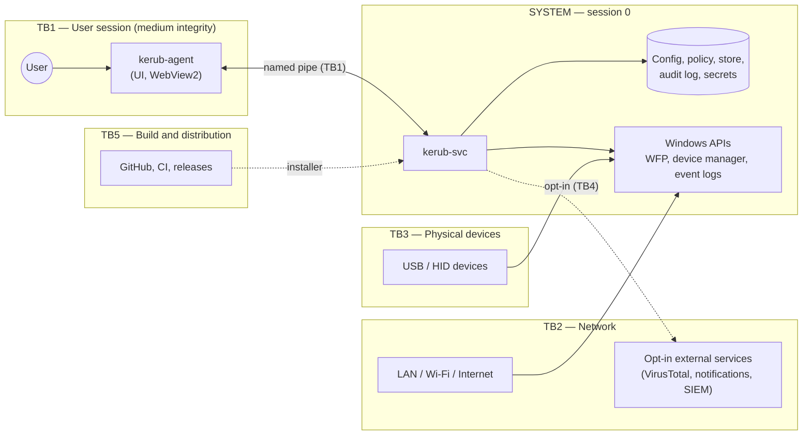

# Kerub — Threat Model

| | |
|---|---|
| **Method** | STRIDE per component, on a data-flow diagram with trust boundaries |
| **Status** | Draft — to be reviewed at the end of every milestone |
| **Related** | [vision.md](vision.md), [architecture.md](architecture.md), [requirements.md](requirements.md) |

This document states what Kerub protects, against whom, how, and — just as
importantly — what it does **not** protect against. Every mitigation listed
here must be traceable to a requirement (category `SEC`) in
[requirements.md](requirements.md).

---

## 1. Scope and assumptions

**In scope:** a single Windows 10 (22H2) or Windows 11 machine running the
three Kerub components:

- `kerub-svc` — Windows service running as `LocalSystem` (session 0);
- `kerub-agent` — tray application running in the user session (medium integrity);
- `kerub-cli` — administration tool, used with elevation.

**Assumptions:**

- A1. The Windows kernel, drivers and firmware are trustworthy.
- A2. Kerub was installed by a legitimate administrator, from an authentic package.
- A3. Windows Defender (or another antivirus) is active; Kerub complements it.
- A4. The primary user does not use an administrator account for daily work
  (Kerub recommends this through its posture audit, but cannot enforce it).

If one of these assumptions is broken, the guarantees below no longer hold.

## 2. Assets

| ID | Asset | Why it matters |
|----|-------|----------------|
| AS1 | User data and credentials on the machine | Primary target of most attacks |
| AS2 | Confidentiality of network traffic | Exposed on public networks and when a VPN drops |
| AS3 | Integrity of the operating system | Persistence, ransomware, tampering |
| AS4 | Kerub itself: binaries, configuration, policy, secrets, action journal | A compromised Kerub is worse than no Kerub |
| AS5 | Kerub's security audit log | Evidence of what happened; must be tamper-evident |
| AS6 | The user's ability to use their machine | Kerub must never lock the user out |
| AS7 | Privacy of data collected by Kerub | Event history reveals behavior (processes, destinations) |

## 3. Adversaries

| ID | Adversary | Capabilities | Scope |
|----|-----------|--------------|-------|
| T1 | Opportunistic physical attacker | Brief access to the machine; plugs a USB stick or a BadUSB device | **In scope** |
| T2 | Attacker on the same local network | Sniffing, LLMNR/NBT-NS poisoning, ARP spoofing, evil twin access point, port scans | **In scope** |
| T3 | Remote attacker on the Internet | Scans and brute-forces exposed services | **In scope** |
| T4 | Malware running as a standard user | Code execution in the user session: persistence, exfiltration, attacks on Kerub's IPC and agent | **In scope** — the central case |
| T5 | Other non-admin user of the machine | Tries to disable Kerub or bypass the USB policy | **In scope** |
| T6 | Supply-chain attacker | Compromised dependency, CI, account or update channel | **In scope** |
| T7 | Attacker with administrator or SYSTEM privileges | Full control of user mode | **Out of scope** for prevention; best-effort detection only |
| T8 | Attacker with long physical access | Removes the disk, boots another OS | **Out of scope** — covered by BitLocker, which Kerub audits |
| T9 | Kernel or firmware attacker | Rootkits, bootkits, malicious drivers | **Out of scope** |

## 4. System and trust boundaries

| Boundary | Between | Main risk |
|----------|---------|-----------|
| TB1 | User session ↔ SYSTEM service | Privilege escalation through the IPC channel |
| TB2 | Machine ↔ network | Remote attacks, leaks |
| TB3 | Machine ↔ physical devices | Malicious devices |
| TB4 | Kerub ↔ external services | Data disclosure, spoofed responses |
| TB5 | Build pipeline ↔ user machine | Malicious code shipped to users |
| TB6 | Event sources ↔ detection engine | Forged events triggering harmful responses |

## 5. Threats and mitigations

Each threat has an ID (`TM-<component>-<n>`) and a STRIDE category:
**S**poofing, **T**ampering, **R**epudiation, **I**nformation disclosure,
**D**enial of service, **E**levation of privilege.

### 5.1 IPC channel (agent ↔ service)

| ID | STRIDE | Threat | Mitigation |
|----|--------|--------|------------|
| TM-IPC-1 | S | A malicious user process connects to the pipe and impersonates the agent (for example to unlock a USB device or disable a module) | Pipe DACL restricted to SYSTEM and the interactive user; the service verifies the client's image path (under Program Files) and Authenticode signature; sensitive requests require re-authentication verified by the service |
| TM-IPC-2 | S | Pipe squatting: malware creates the pipe first to capture the agent's messages and the unlock password | Service creates the pipe with `FILE_FLAG_FIRST_PIPE_INSTANCE` at startup; the agent verifies the server process runs as SYSTEM from the expected path before sending anything |
| TM-IPC-3 | E | A malformed message exploits a parsing bug in the SYSTEM service | Memory-safe language, with `unsafe` code confined to the platform layer; strict schema validation; maximum message size; typed requests only — no generic "execute" command; fuzzing of the parser |
| TM-IPC-4 | D | A process floods the pipe to block the service | Connection limit, per-client rate limiting, read timeouts |
| TM-IPC-5 | R | A harmful request cannot be attributed | Every request is written to the audit log with client PID, image path and user SID |
| TM-IPC-6 | S | Password brute-force through the IPC | Rate limiting with exponential back-off; lockout events logged and alerted |

### 5.2 Service (`kerub-svc`)

| ID | STRIDE | Threat | Mitigation |
|----|--------|--------|------------|
| TM-SVC-1 | T | Binary replacement or DLL hijacking | Install under Program Files (admin-only write); quoted service path; DLL search restricted to System32 at startup (`SetDefaultDllDirectories`); no DLL loaded from a relative or user-writable path |
| TM-SVC-2 | D | A non-admin user stops, reconfigures or kills the service | Service and process DACLs deny these rights to non-admins |
| TM-SVC-3 | D | An admin-level attacker stops the service (T7) | Out of scope for prevention. Detection: agent heartbeat, alert when the service disappears, gap visible in the audit log |
| TM-SVC-4 | E | The service holds more privileges than it needs | Declared required-privileges list; every other privilege removed from the token |
| TM-SVC-5 | D | An unhandled panic crashes the whole service | Every task runs under a supervisor that detects panics and restarts the affected module; automatic service restart configured; persistent protections survive a crash (fail-closed) |

### 5.3 Agent (`kerub-agent`)

| ID | STRIDE | Threat | Mitigation |
|----|--------|--------|------------|
| TM-AG-1 | S | Malware shows a fake Kerub prompt to phish the unlock password | Every genuine prompt displays a personal security phrase chosen at setup; disabling protections requires UAC elevation (secure desktop), not only the password |
| TM-AG-2 | T | Malware injects into or modifies the agent | The agent holds no authority: every decision and verification happens in the service |
| TM-AG-3 | E | Script injection in the WebView2 UI through event data (file names, command lines, hostnames controlled by an attacker) | Event data is never rendered as HTML; strict Content Security Policy; no remote content loaded; minimal set of commands exposed to the front-end, restricted by Tauri's capability system |
| TM-AG-4 | I | A keylogger in the user session captures the unlock password | Accepted risk (R2); the password only unlocks low-impact actions |

### 5.4 Data stores (configuration, policy, database, audit log, secrets)

| ID | STRIDE | Threat | Mitigation |
|----|--------|--------|------------|
| TM-ST-1 | T | Configuration or policy modified to weaken protection | Data directory in ProgramData, ACL limited to SYSTEM and Administrators; the service is the only writer; configuration validated on every load |
| TM-ST-2 | T | Audit log entries modified or deleted to hide activity | Hash chaining: each entry contains the hash of the previous one; optional forwarding to an external SIEM |
| TM-ST-3 | I | Event history reveals user behavior | Same ACL; limited retention; data minimization documented in [privacy.md](privacy.md) |
| TM-ST-4 | I | Offline cracking of the unlock password | Argon2id with strong parameters; secrets protected with machine-scope DPAPI |
| TM-ST-5 | D | Disk exhaustion by event volume | Retention period and size caps on the database and logs |

### 5.5 Detection inputs (event logs, Sysmon, network, device notifications)

| ID | STRIDE | Threat | Mitigation |
|----|--------|--------|------------|
| TM-DET-1 | S/T | Forged events trick Kerub into a harmful response (for example blocking the gateway or DNS server) | Only trusted channels and providers are used as input; a never-block list (loopback, gateway, DNS servers, VPN server); automatic responses are rate-limited and expire |
| TM-DET-2 | D | Event flood exhausts CPU or memory | Bounded queues; dropped events are counted and trigger an alert |
| TM-DET-3 | — | Attacker evades detection | Accepted risk (R4): detection is best effort, never a guarantee |

### 5.6 Response actions (network filters, device control)

| ID | STRIDE | Threat | Mitigation |
|----|--------|--------|------------|
| TM-RSP-1 | D | A bug or bad rule locks the user out (network or devices) | Audit mode before enforcement; every action journaled with its undo information and expiry; maintenance mode; documented recovery procedure and emergency reset script ([dev/recovery.md](dev/recovery.md)) |
| TM-RSP-2 | T | Orphan rules remain after a crash or uninstall | All filters carry Kerub's own provider and sublayer identifiers; reconciliation at startup; full cleanup on uninstall |

### 5.7 Network guard and VPN

| ID | STRIDE | Threat | Mitigation |
|----|--------|--------|------------|
| TM-NET-1 | I | Traffic leaks when the VPN drops (including DNS and IPv6) | Kill switch implemented as persistent WFP filters; DNS and IPv6 handled explicitly |
| TM-NET-2 | I | Leaks at boot, before the service starts | Persistent and boot-time filters that the OS enforces without Kerub running |
| TM-NET-3 | S | Credential theft through LLMNR / NBT-NS poisoning on public networks | Legacy name resolution and SMB exposure disabled under the public profile |
| TM-NET-4 | S | Evil twin access point impersonating a known network | Best-effort detection (unexpected BSSID or security type for a known SSID) |
| TM-NET-5 | D | Kill switch blocks access to a captive portal | Explicit, time-limited exception triggered by the user, logged |

### 5.8 Device control

| ID | STRIDE | Threat | Mitigation |
|----|--------|--------|------------|
| TM-DEV-1 | E | A BadUSB device types commands before Kerub reacts | Preventive device installation restrictions enforced by Windows; any new HID device requires confirmation |
| TM-DEV-2 | S | An attacker spoofs the identifiers of an allowed device | Accepted risk (R3): VID, PID and serial number can be forged; the allow-list reduces the risk without eliminating it |

### 5.9 External services (opt-in)

| ID | STRIDE | Threat | Mitigation |
|----|--------|--------|------------|
| TM-EXT-1 | I | Queries reveal information about the user's files | Disabled by default; only hashes are sent, never file contents |
| TM-EXT-2 | S | Man-in-the-middle on API calls | TLS with system certificate validation; no custom trust store |
| TM-EXT-3 | I | API keys and tokens stolen from disk | Stored with machine-scope DPAPI in the protected data directory |

### 5.10 Supply chain and distribution

| ID | STRIDE | Threat | Mitigation |
|----|--------|--------|------------|
| TM-SC-1 | T | Compromised third-party dependency | Minimal dependencies; `Cargo.lock` and npm lockfile committed; cargo-audit, cargo-deny and Dependabot in CI; every new dependency justified |
| TM-SC-2 | T | Malicious update delivered to users | No automatic update before v1.0; later, updates signed (ed25519) and verified before being applied |
| TM-SC-3 | T | Compromised GitHub account or CI | 2FA; signed commits; branch protection; GitHub Actions pinned by commit SHA with least-privilege tokens |
| TM-SC-4 | T | Users cannot verify the binaries they download | Published checksums; code signing of releases |
| TM-SC-5 | T | AI-assisted development introduces vulnerabilities | Human review of every change; security review against this document; tests required before merge |

## 6. Accepted risks

These risks are known and deliberately not mitigated (or only partially).
They must be stated honestly in the README.

| ID | Risk | Rationale |
|----|------|-----------|
| R1 | An attacker with admin or SYSTEM privileges can disable Kerub | Preventing it requires a Microsoft-signed kernel component (ELAM / PPL), out of reach for this project; detection remains best effort |
| R2 | A keylogger in the user session can capture the unlock password | Inherent to user-mode prompts; impact limited by design (TM-AG-1, TM-AG-4) |
| R3 | USB device identifiers can be spoofed | Hardware identifiers are not authenticated by USB |
| R4 | Detection can be evaded | No detection system is complete; Kerub reduces risk, it does not eliminate it |
| R5 | Some protections are inactive before the service starts at boot | Partially mitigated by persistent filters and OS-enforced device policies |
| R6 | Offline physical attacks (disk removal) | Out of Kerub's reach; BitLocker is audited and recommended |

## 7. Maintenance of this document

- Reviewed at the end of every milestone and whenever a new module, external
  service or IPC request is added.
- Every new threat receives an ID; IDs are never reused.
- Changes are listed in the project [CHANGELOG](../CHANGELOG.md).